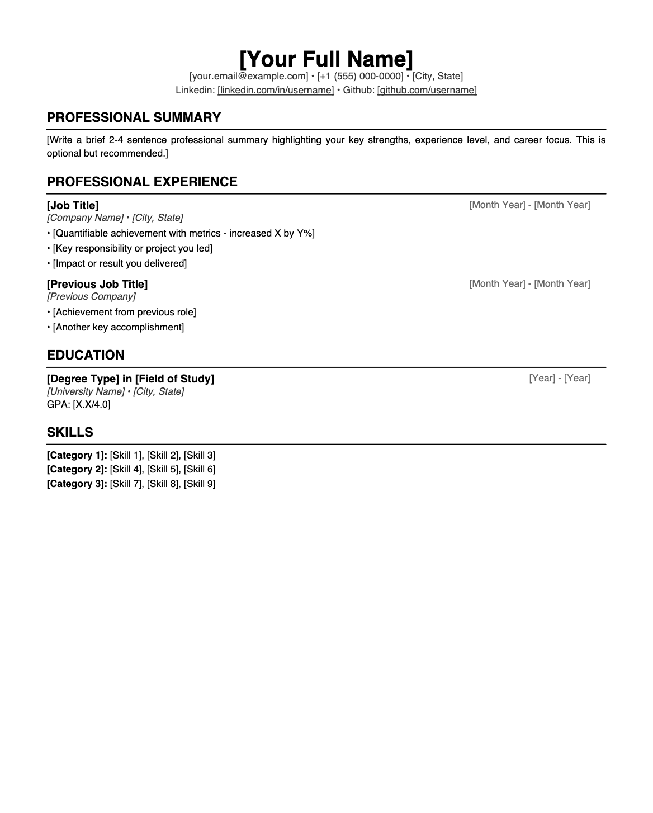
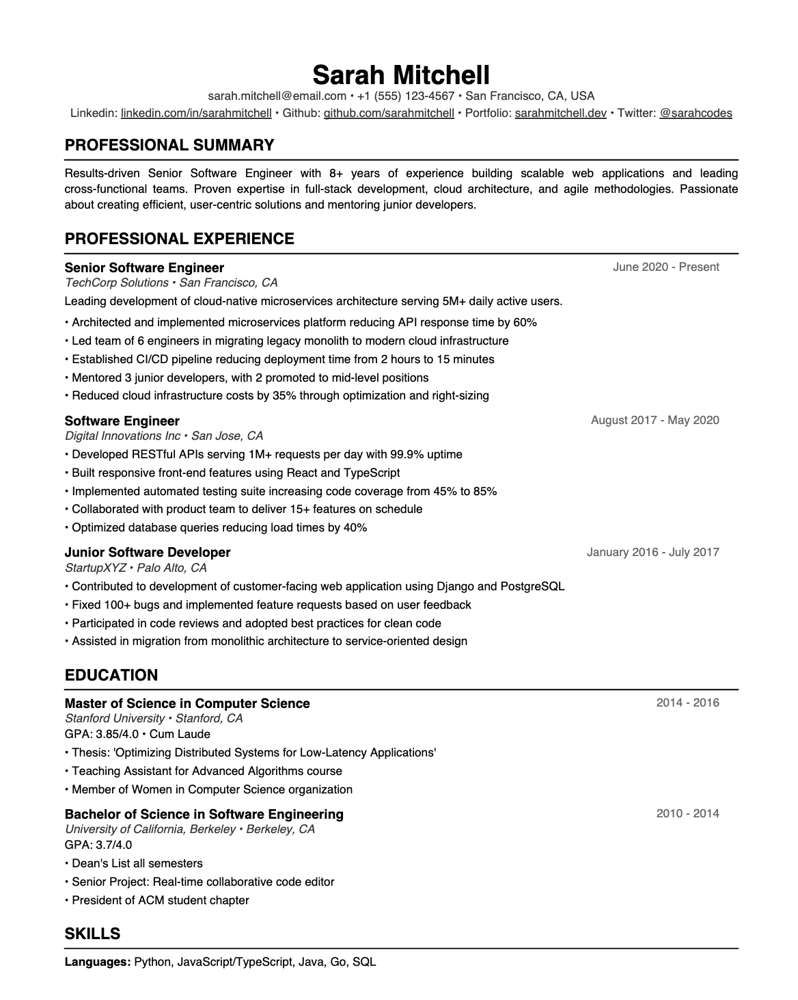

# Professional Resume Generator

A Python tool that converts YAML files into professional, ATS-friendly PDF resumes with clean black and white formatting. Configurable fonts, spacing, and comprehensive section support.

<p align="center">
  
  
</p>


## Quick Start

### From Repository

```bash
# 1. Clone or download this repository
git clone <repository-url>
cd resume-generator

# 2. Create and activate virtual environment (recommended)
python3 -m venv venv

# On macOS/Linux:
source venv/bin/activate

# On Windows:
venv\Scripts\activate

# 3. Install dependencies
pip install -r requirements.txt
# Or manually: pip install pyyaml reportlab

# 4. Generate sample resume to test
python3 resume_generator.py example_resume.yaml

# 5. You should see a PDF in: `output/`
```

### Create Your Own

```bash
# 1. Copy the template as starting point
cp minimal_resume.yaml my_resume.yaml

# 2. Edit my_resume.yaml with your information

# 3. Generate your resume
python resume_generator.py my_resume.yaml

# 4. Find your resume in: `output/[Your_Name]_resume.pdf`
```

### Repository Structure
```
resume-generator/
├── resume_generator.py          # Main script
├── minimal_resume.yaml          # Basic template
├── example_resume.yaml          # Full-featured example
├── example_with_config.yaml     # Customization example
├── README.md                    # This file
└── output/                      # Generated PDFs appear here
```

## Usage

1. Copy `minimal_resume.yaml` or `example_resume.yaml` as a starting point
2. Edit the YAML file with your information
3. Run: `python resume_generator.py your_resume.yaml`
4. Find your PDF in the `output/` directory

## YAML Structure

### Required Section

```yaml
personal:
  name: "Your Name"              # REQUIRED
  email: "email@example.com"
  phone: "+1 (555) 123-4567"
  location: "City, State"
  links:                         # Optional
    linkedin: "linkedin.com/in/username"
    github: "github.com/username"
    portfolio: "website.com"
```

### Optional Sections

#### Professional Summary
```yaml
summary: >
  Brief 2-4 sentence professional summary highlighting key strengths and experience.
```

#### Work Experience
```yaml
experience:
  - title: "Job Title"
    company: "Company Name"
    location: "City, State"
    start_date: "Month Year"
    end_date: "Month Year"       # or use present: true
    present: true                # for current positions
    description: "Brief overview" # Optional
    highlights:
      - "Quantifiable achievement with numbers/metrics"
      - "Key responsibility or project"
      - "Impact or result delivered"
```

#### Education
```yaml
education:
  - degree: "Bachelor of Science"
    field: "Computer Science"
    institution: "University Name"
    location: "City, State"
    start_date: "2018"
    end_date: "2022"
    gpa: "3.8/4.0"               # Optional
    honors: "Cum Laude"          # Optional
    highlights:                  # Optional
      - "Relevant coursework or achievement"
```

#### Skills
```yaml
# Option 1: Categorized (Recommended)
skills:
  Languages: ["Python", "JavaScript", "Java"]
  Frameworks: ["React", "Django", "Spring"]
  Tools: ["Git", "Docker", "AWS"]

# Option 2: Simple list
skills:
  - Python
  - JavaScript
  - React
```

#### Projects
```yaml
projects:
  - name: "Project Name"
    date: "2023"
    technologies: ["Tech1", "Tech2"]
    description: "Brief project description"
    highlights:
      - "Key feature or achievement"
    url: "github.com/username/project"  # Optional
```

#### Certifications
```yaml
certifications:
  - name: "AWS Certified Solutions Architect"
    issuer: "Amazon Web Services"
    date: "2023"
    credential_id: "ABC123"      # Optional
```

#### Awards
```yaml
awards:
  - name: "Award Name"
    issuer: "Organization"
    date: "2023"
    description: "Brief description"  # Optional
```

#### Publications
```yaml
publications:
  - title: "Paper Title"
    authors: ["Author 1", "Author 2"]
    venue: "Conference/Journal Name"
    date: "2023"
    doi: "10.1234/example"       # Optional
```

#### Languages
```yaml
# Option 1: Dictionary
languages:
  English: "Native"
  Spanish: "Professional Working Proficiency"

# Option 2: List
languages:
  - name: "English"
    level: "Native"
```

#### Volunteer
```yaml
volunteer:
  - role: "Volunteer Role"
    organization: "Organization Name"
    start_date: "2020"
    end_date: "Present"
    present: true
    description: "Brief description"
    highlights:
      - "Impact or achievement"
```

## Configuration

Customize formatting by adding a `config` section (all optional):

```yaml
config:
  # Font settings
  fonts:
    name: "Helvetica"            # Body font
    name_bold: "Helvetica-Bold"  # Bold font
    name_italic: "Helvetica-Oblique"  # Italic font
    name_size: 20                # Name font size (default: 20)
    section_header_size: 12      # Section headers (default: 12)
    title_size: 10               # Job titles, degrees (default: 10)
    body_size: 9                 # Body text (default: 9)
  
  # Spacing settings (in inches)
  margin: 0.6                    # Page margins (default: 0.6)
  section_spacing: 0.08          # Space between sections (default: 0.08)
  item_spacing: 0.06             # Space between items (default: 0.06)
  
  # Section order (header and footer always first/last)
  section_order:                 # Customize order of sections
    - summary
    - education                  # Put education before experience
    - skills
    - experience
    - projects
    - certifications
    # awards                     # Omit sections you don't want
    # publications
    # languages
    # volunteer
  
  # Footer
  footer: true                   # Add generator attribution (default: false)
```

### Section Order

Control which sections appear and in what order. Header (personal info) is always first, footer is always last.

**Available sections:**
- `summary` - Professional summary
- `experience` - Work experience
- `education` - Education background
- `skills` - Technical and soft skills
- `projects` - Personal or professional projects
- `certifications` - Professional certifications
- `awards` - Awards and honors
- `publications` - Academic or professional publications
- `languages` - Language proficiencies
- `volunteer` - Volunteer experience

**Default order:** summary, experience, education, skills, projects, certifications, awards, publications, languages, volunteer

**Examples:**

Recent graduate (education first):
```yaml
config:
  section_order: ["summary", "education", "skills", "projects", "experience"]
```

Career changer (skills emphasis):
```yaml
config:
  section_order: ["summary", "skills", "projects", "certifications", "experience", "education"]
```

Minimal resume (essentials only):
```yaml
config:
  section_order: ["summary", "experience", "education", "skills"]
```

### Available Fonts
Standard PDF fonts (no installation required):
- `Helvetica` (default)
- `Helvetica-Bold`
- `Helvetica-Oblique`
- `Times-Roman`
- `Times-Bold`
- `Times-Italic`
- `Courier`
- `Courier-Bold`
- `Courier-Oblique`

## YAML Tips

**Multi-line text** (summary, descriptions):
```yaml
summary: >
  This will be combined into
  a single paragraph with spaces.
```

**Lists**:
```yaml
highlights:
  - "First item"
  - "Second item"
```

**Quotes** (for special characters):
```yaml
company: "Smith & Associates"
```

**Comments**:
```yaml
# This is a comment
personal:
  name: "John Smith"
  # email: "old@email.com"  # Commented out
```

**Date formats** (any format works):
- "January 2020"
- "Jan 2020"
- "01/2020"
- "2020"

## Troubleshooting

**YAML parsing error**
- Use spaces, not tabs for indentation
- Ensure quotes are properly closed
- Validate at yamllint.com

**Missing sections in PDF**
- Empty sections are automatically skipped
- Check section names match exactly (case-sensitive)

**Content doesn't fit**
- Reduce font sizes in config
- Reduce margins and spacing
- Shorten bullet points
- Consider removing less relevant content

**Font not working**
- Ensure font name matches standard PDF fonts exactly
- Use `Helvetica`, `Times-Roman`, or `Courier` families

## Requirements

- Python 3.7+
- PyYAML
- ReportLab

```bash
pip install pyyaml reportlab
```